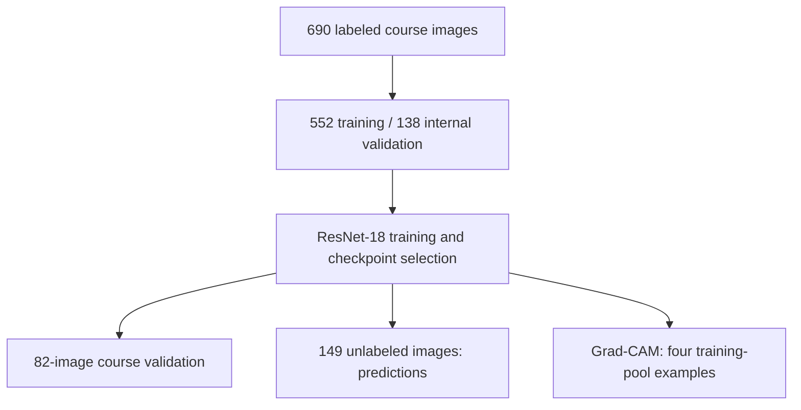
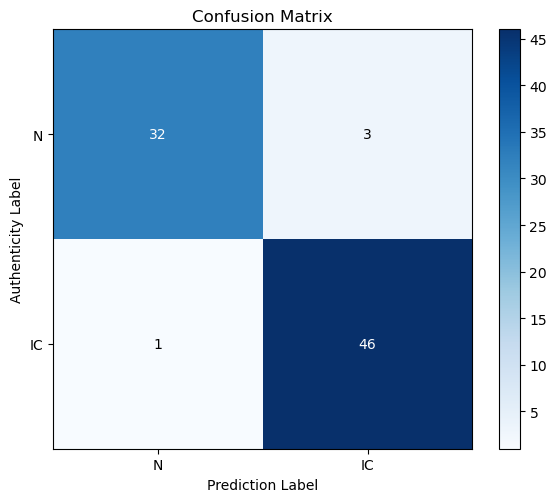
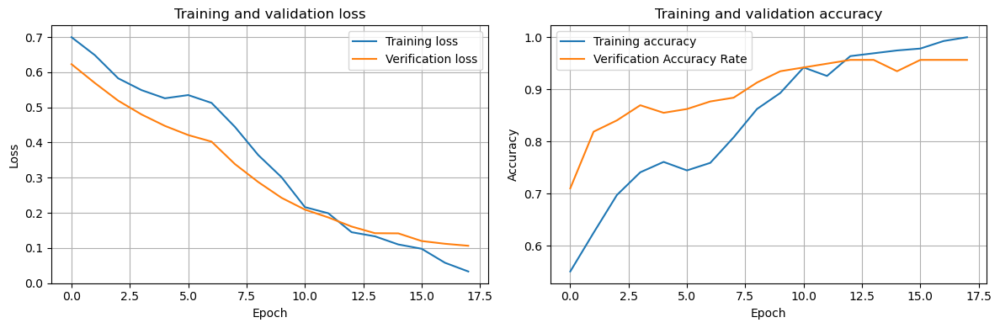
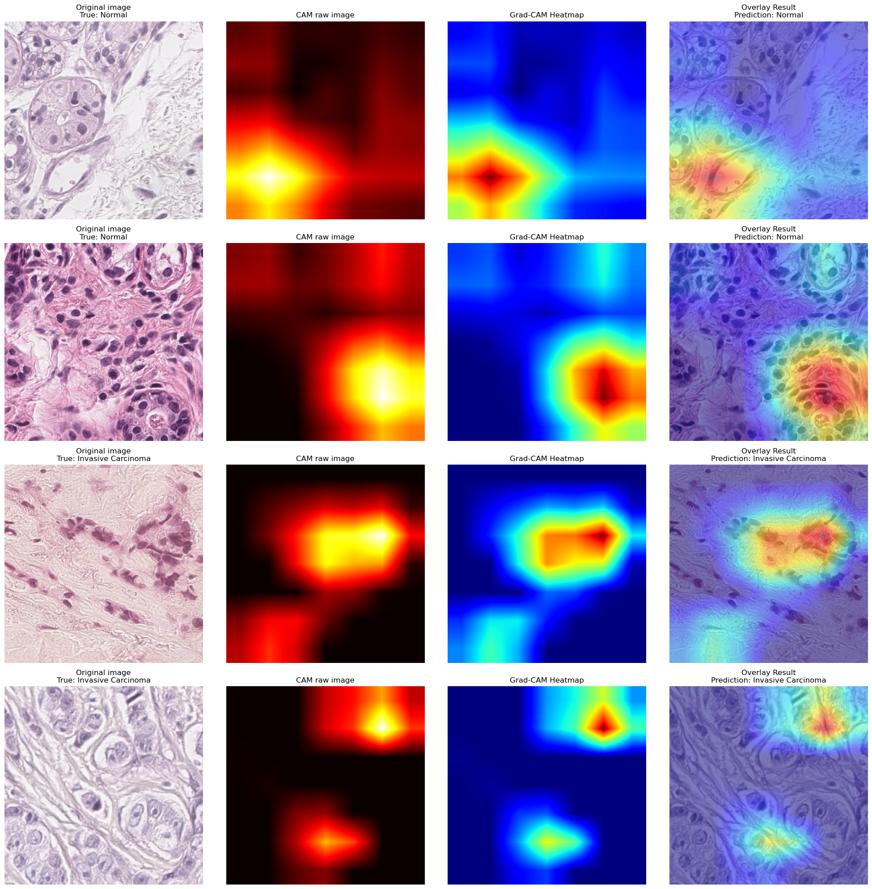

# Breast Histopathology Classification with ResNet-18

Transfer learning for normal-versus-invasive-carcinoma classification of H&E breast tissue images, with validation metrics, unlabeled-image predictions and Grad-CAM visualizations.

**Author:** Zirui Chen  
**Context:** Deep learning coursework (HW6.2), reorganized as a portfolio project.

This project documents an original coursework experiment. The notebook has been edited for readability, **not rerun**. Figures and numeric results below come from the saved submission. It is not a clinical diagnostic tool.

## Start here

- [Main notebook](notebooks/01_breast_histopathology_classification.ipynb): model, training, validation, prediction and Grad-CAM in one sequential document.
- [Data specification and provenance](data/README.md): expected folders, labels, image dimensions and source limitations.
- [Method notes](docs/method_notes.md): implementation details, interpretation limits and editorial changes.
- [Recorded results](results/README.md): original metrics, predictions and console output.

## Approach

The model uses an ImageNet-pretrained ResNet-18 with a custom two-class head. Images are resized to 224 × 224 and normalized using ImageNet statistics. Training uses cross-entropy, AdamW, cosine annealing, partial backbone unfreezing and early stopping.



The source defines augmentation, but a shared-dataset transform assignment overwrites it before training. The recorded result is therefore **not presented as an augmentation result**. The original behavior is documented rather than silently corrected without retraining.

## Recorded validation results

The separate course-provided validation set contains 35 normal and 47 invasive-carcinoma images.

| Metric | Recorded value |
| --- | ---: |
| Accuracy | 95.12% (78/82) |
| Sensitivity — invasive carcinoma | 97.87% (46/47) |
| Specificity — normal tissue | 91.43% (32/35) |
| Precision — invasive carcinoma | 93.88% (46/49) |



The 149 unlabeled images produced 59 normal and 90 invasive-carcinoma predictions. Labels are unavailable, so no test accuracy is reported.

### Training history



### Grad-CAM examples



These four examples come from the training directory. Heatmaps illustrate class-score contributions, not verified tumour localization. Softmax scores are not calibrated confidence estimates. These saved panels include course images whose original reuse permissions are unspecified; confirm permission before public redistribution.

## Data source

Images were distributed through **NTULearn** for HW6.2. The assignment describes H&E breast tissue images of 512 × 512 pixels at 0.25 micrometres per pixel. **It does not identify the original dataset or publication.** No unverified dataset attribution or download link is provided.

Raw images and trained weights are not included. See [data/README.md](data/README.md) for the three expected input folders. Patient-level separation cannot be verified from the supplied materials.

## Repository contents

| Path | Purpose |
| --- | --- |
| `notebooks/` | One main notebook with seven named sections |
| `data/README.md` | Provenance and input specifications |
| `data/raw/` | Local-only input images; ignored by Git |
| `models/` | Local-only checkpoint; ignored by Git |
| `figures/` | Unaltered figures extracted from the original notebook |
| `results/` | Archived metrics, prediction sequence and console output |
| `docs/method_notes.md` | Method limitations and revision record |
| `requirements.txt` | Required packages; original versions were not recorded |

## Local use

```bash
python -m pip install -r requirements.txt
jupyter lab notebooks/01_breast_histopathology_classification.ipynb
```

Run these commands from the repository root after obtaining the authorized course images and placing them under `data/raw/`. Reading the notebook does not require running it. Executing all cells starts model training and may download ImageNet weights; later sections need a trained checkpoint. New prediction and Grad-CAM files go to `results/generated/`, separate from archived results.

This revision was checked statically, not executed end to end. Original dependency versions are unknown, and the retained pretrained-model/backward-hook APIs may require adjustments in a different environment. The recorded experiment used CPU; inference and Grad-CAM explicitly use CPU in the portfolio notebook.

## Scope and limitations

The project demonstrates transfer-learning implementation, evaluation using confusion-matrix metrics, prediction export and Grad-CAM inspection. It does not establish patient-independent generalization, external clinical validity or calibrated uncertainty. The small course-validation set, shared-transform behavior, repeated optimizer resets and missing environment/checkpoint information should be considered when interpreting the numbers. Full details are in the [method notes](docs/method_notes.md).

## Attribution

Code adapted from Zirui Chen's submitted HW6.2 notebook. The model backbone is provided by torchvision; Grad-CAM follows the class-activation approach used in the coursework. Assignment instructions and raw image archives are not redistributed here. No blanket licence is asserted for the course images or third-party materials.
